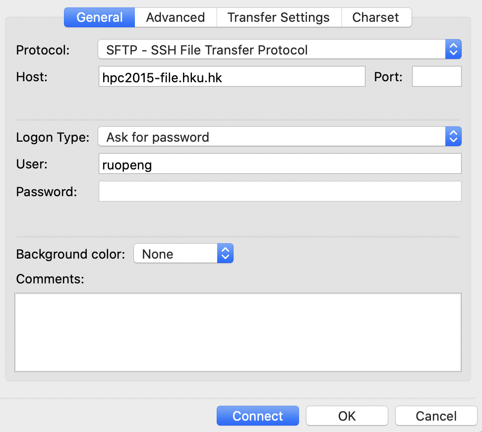

# HKU_HPC2015
This guide will provide you the basic steps about how to set up common phylogenetic analysis on HPC clusters at University of Hong Kong.

### Request an HPC account
Both staff and student in HKU can apply for this account. Please follow this link[https://www.its.hku.hk/services/research/hpc/account](https://www.its.hku.hk/services/research/hpc/account) step by step. After about three work days, you will receive your own HPC account and password via email.

### Log in and set up transfer data to/from the HPC cluster
* network requirement: PC accessing HKU campus network (WiFi: [HKU](https://www.its.hku.hk/documentation/guide/network/wifi/hkuwifi); Off-campus: [HKUVPN](https://www.its.hku.hk/documentation/guide/network/remote/hkuvpn2fa))
* connect via SSH: `ssh -l [username] hpc2015`
* configuration for transferring data: 

Reference: [https://www.its.hku.hk/services/research/hpc/userguide](https://www.its.hku.hk/services/research/hpc/userguide)

### install BEAST on the HPC cluster
We have to install BEAST by ourselves because the software list of HPC doesn't include it.
* load several modules to support installation environment for BEAST
    * `module load gcc/8.2.0`
    * `module load cuda/10.2`
    * `module load autoconf/2.69`
    * `module load binutils/2.25.1`
* download BEAST from [BEAST v1.10.4 - UNIX/Linux version 18.9MB](https://github.com/beast-dev/beast-mcmc/releases/download/v1.10.4/BEASTv1.10.4.tgz) and upload it to HPC cluster
* ~~install JAVA~~ (There is no need because HPC has JAVA 1.8 environment and you can use `java -version` to check)
* unzip: `tar -zxvf BEASTv1.10.4.tgz`
* set environment variables:
    * `vim ~/.bash_profile`
    * add one line: `export PATH=$PATH:$HOME/BEASTv1.10.4/bin/`
    * `source ~/.bash_profile`
* install BEAGLE library
    * `git clone --depth=1 https://github.com/beagle-dev/beagle-lib.git`
    * `cd beagle-lib`
    * `./autogen.sh`
    * `./configure --prefix=$HOME --with-cuda=/share1/cuda/10.2/`
    * `make install`

Reference: 
* [https://beast.community/install_on_unix](https://beast.community/install_on_unix)
* [https://github.com/beagle-dev/beagle-lib/wiki/LinuxInstallInstructions](https://github.com/beagle-dev/beagle-lib/wiki/LinuxInstallInstructions)

### submit the job